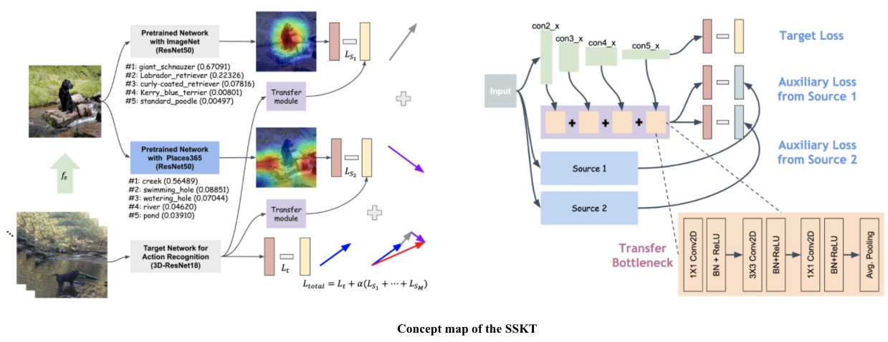

SSKT(under review at CVPR2021)
================================

Concept map
-----------


Dataset
-------
* Image dataset
  * CIFAR10 (torchvision)
  * CIFAR100 (torchvision)
  * STL10 (torchvision)
  * Pascal VOC (torchvision)
  * ImageNet (torchvision)
  * [Places365](http://places2.csail.mit.edu/download.html)
* Video dataset
  * [UCF101](https://www.crcv.ucf.edu/data/UCF101.php)
  * [HMDB51](https://serre-lab.clps.brown.edu/resource/hmdb-a-large-human-motion-database/)

Pre-trained models
------------------
* __Imagenet__
  * we used the pre-trained model in torchvision. 
  * using resnet18, 50
* __Places365__
  * [Resnet50](https://github.com/CSAILVision/places365)

Option 
--------
* isSource
  * Single Source Transfer Module
  * Transfer Module X, Only using auxiliary layer
* transfer_module 
  * Single Source Transfer Module
* multi_source 
  * multiple task transfer learning

Training
--------
* 2D PreLeKT
```
 python main.py --model resnet20  --source_arch resnet50 --sourceKind places365 --result /raid/video_data/output/PreLeKT --dataset stl10 --lr 0.1 --wd 5e-4 --epochs 200 --classifier_loss_method ce --auxiliary_loss_method kd --isSource --multi_source --transfer_module
```

* 3D PreLeKT 
```
 python main.py --root_path /raid/video_data/ucf101/ --video_path frames --annotation_path ucf101_01.json  --result_path /raid/video_data/output/PreLeKT --n_classes 400 --n_finetune_classes 101 --model resnet --model_depth 18 --resnet_shortcut A --batch_size 128 --n_threads 4 --pretrain_path /nvadmin/Pretrained_model/resnet-18-kinetics.pth --ft_begin_index 4 --dataset ucf101 --isSource --transfer_module --multi_source
```

paper download
--------------
* Review Paper
  * ./paper/SSKT_review.pdf
* Supplementary Materials
  * ./paper/SSKT_supplement.pdf
